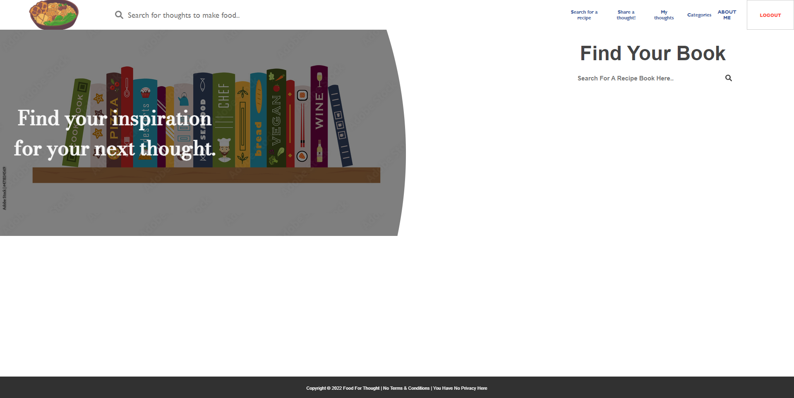
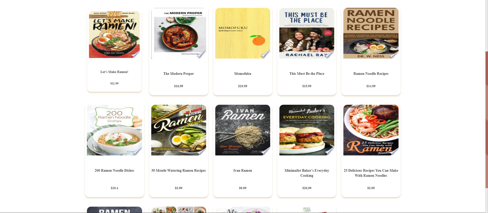
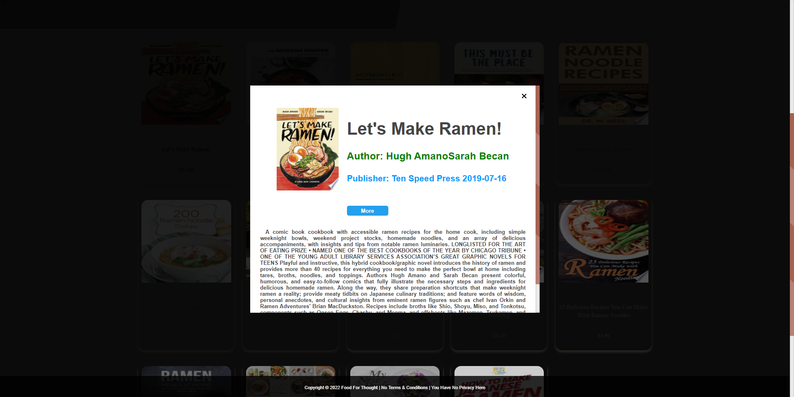
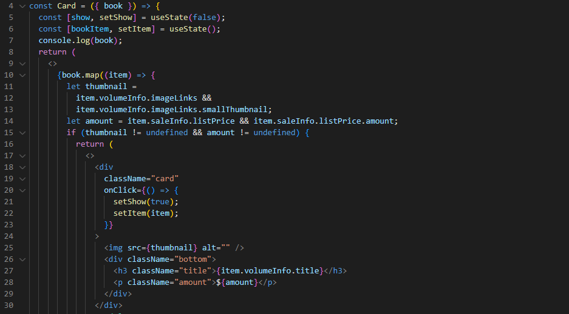
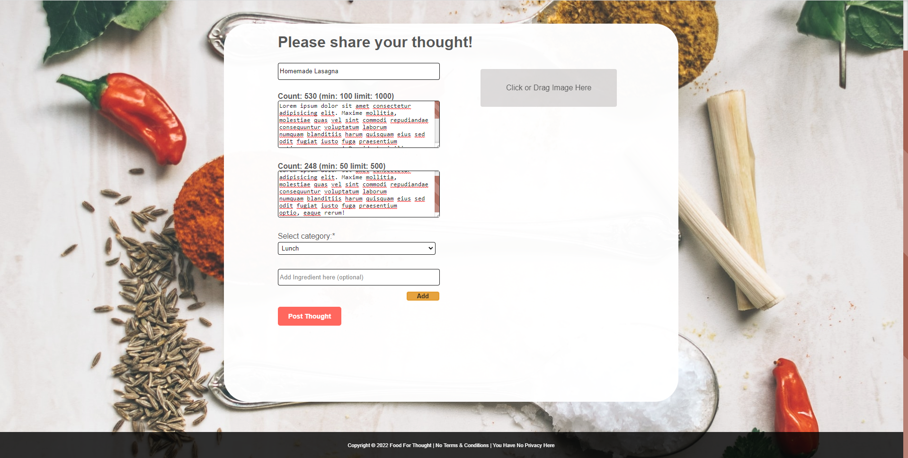
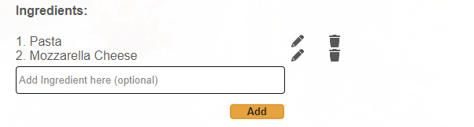
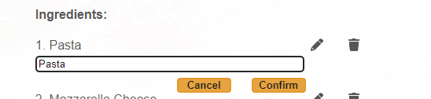
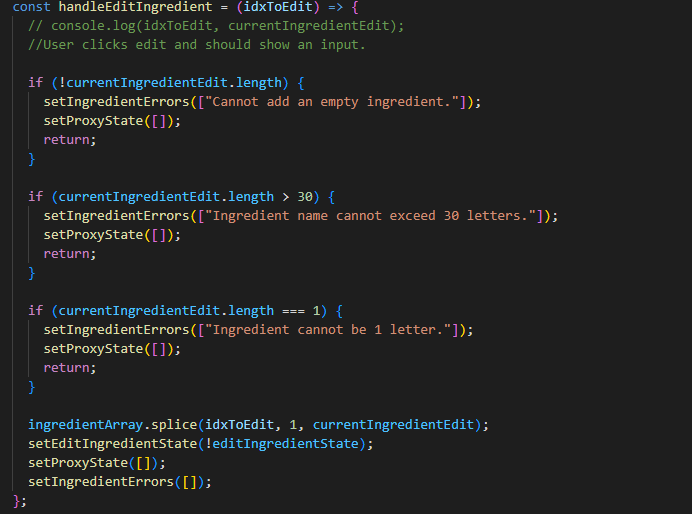
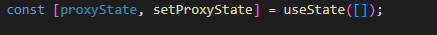

# Food For Thought

This is a clone of [Cooking by NY Times](https://cooking.nytimes.com/).

# Index

TODO add links to feature list etc.

# Technologies Used


Food For Thought was developed using React, Redux, Flask, and SQLAlchemy to create a model-view-controller (MVC) application. Heroku was used for production hosting, and AWS S3 was used to host files uploaded by users for use with the application.

## Clone this project.

1. Clone this repository (only this branch)

   ```bash
   git clone https://github.com/appacademy-starters/python-project-starter.git
   ```

2. Install dependencies

   ```bash
   pipenv install --dev -r dev-requirements.txt && pipenv install -r requirements.txt
   ```

3. Create a **.env** file based on the example with proper settings for your
   development environment
4. Setup your PostgreSQL user, password and database and make sure it matches your **.env** file

5. Get into your pipenv, migrate your database, seed your database, and run your flask app

   ```bash
   pipenv shell
   ```

   ```bash
   flask db upgrade
   ```

   ```bash
   flask seed all
   ```

   ```bash
   flask run
   ```

6. To run the React App in development, checkout the [README](./react-app/README.md) inside the `react-app` directory.

---

_IMPORTANT!_
psycopg2-binary MUST remain a dev dependency because you can't install it on alpine-linux.
There is a layer in the Dockerfile that will install psycopg2 (not binary) for us.

---

# Key Functions

## Thoughts, Ingredients and Categories

Food For Thought allows users to liberally add thoughts(recipes) to the application to include recipe information and ingredients (independent of recipe data). Users also attribute thoughts to categories that were predefined by the application developer. Thoughts can also accommodate a featured image per recipe after a recipe's creation.

## Reviews

Users can add reviews to any recipe on Food For Thought, which includes a star rating from one through five. Each recipe dynamically averages the total ratings and displays the results when a recipe is "READ".

# Features Highlight

## Interactive Thought Page

Food For Thought's thought detail page showcases complex dynamic rendering on simple, smooth and easy UI/UX for users. Users can CRUD ingredients and CRUD reviews on the same page without refresh.


Users are given the full CRUD option to add/edit or delete their ingredients to their newly created thought.


Users are given the full CRUD option to add/edit or delete their reviews in the same thought detail page.

When a user hovers on a review they posted, they are shown an edit and delete icon.


## Star Ratings

Each thought's ratings are updated as soon as another user posts a rating/review. It also calculates the percentage value of the rating based on its average and displays it dynamically as stars.


# Search/Filter Features

## Search Thought (Recipe)

Users can query the database based on the search input's value.


## Filter by Categories

Main page dynamically renders and live filters the thoughts (recipes) based on the category selected by the user.


## Search For a Recipe Book

- Integrated Google books API, Food For Thought application can perform full-text searches and retrieve book information, viewability and eBook availability.

- Search and browse throught a list of books that match the user's query.
- Ability to view information about a book, including metadata, availability, price and links where the user can purchase the book.






## Code snippets

This component defines the default state as an empty array. Using axios (promise based HTTP client for browser and Node.js), was able to do a "READ" operation. The user's search input is passed as an argument for the query. The promise's result is set as the new data array which we can render in the front end. The max results is set to 40.


#

Each element in the bookData array is mapped and passed into the Card component. Inside the card component we display the thumbnail image, title and price of the book. Using state manipulation, when the user clicks the card component it sets the show state to true and the bookItem to that item which displays the modal (info) for the user.



# Dynamic Thought (Recipe) Form

TODO, still need to fix thought page. Don't forget to put code snippets and also the setProxyState([]).

Per input, the user is notified how many characters the current input has. Each input notifies the user if it is required, the min and max values it can contain.

Users can also add multiple ingredients for the thought(recipe).



## Code snippets

When a user decides to edit the ingredient they added, when they click confirm. An onlick function which passes the ingredient's current index as an argument. The function uses the ingredient's index to splice and update it with the edit input's value.

It also has to pass error handling before the edit can be confirmed. In order to trigger a re-render of the component. There needs to be a detected change between the real DOM vs. the virtual DOM.



When we invoke the function setProxyState and pass an empty array, the virtual DOM is compared with the real DOM and a change is detected. Therefore, the component will rerender along with its updated states.

#



## Future Features

- Introduce more complexity for the ingredients table. Allow users to quantify their selected ingredients enabling them to input measurements as well.

- A notifications tab which notifies the user if another user left a review on their thought (recipe).

- Allow the user to post a video along with the instructions table that demonstrates how to prepare the dish.

- Allow users to bookmark a thought (recipe) and also access their bookmark page.
